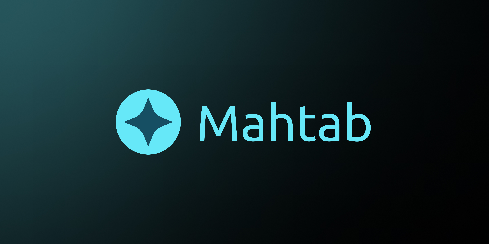

# Mahtab
A Dead Simple Personal Portfolio

## Development

### Requirements
Please make sure you have the following applications on your system:
 - [NodeJS v21](https://github.com/nodejs/node)
 - [Pnpm v8.11](https://github.com/pnpm/pnpm)

### Installing the dependencies
Run the following command to install the dependencies

```bash
pnpm i
```

### Running the development server
Run the following command to start the development server

```bash
pnpm run dev
```

For more info regarding the main framework of this project [Astro](https://github.com/withastro/astro) please refer to their [docs](https://docs.astro.build/en/getting-started/).

> [!TIP]
> Here are the rest of the libraries used in this project:
>   - [Preact](https://github.com/preactjs/preact)
>   - [Fuse JS](https://github.com/krisk/Fuse)
>   - [Konj UI](https://github.com/konj-org/ui)


## Customizing the website

### Key informations

You have to update the following files to update the key information on the website

#### [data.json](src/data/data.json) - `src/data/data.json`
```json
{
  "title": "Mahtab", // Your website title
  "description": "A Dead Simple Personal Portfolio",  // Your website description
  "websiteURL": "https://mahtab.konj.org", // The URL of website after hosting
  "socials": [
    // Optional
    {
      "name": "Github",
      "icon": "simple-icons:github",
      // The link to your Github
      "href": "https://github.com/konj-org/ui"
    },
    // Optional
    {
      "name": "Linkedin",
      "icon": "simple-icons:linkedin",
      // The link to your Linkedin
      "href": "https://www.linkedin.com/company/konj-org"
    }
  ]
}
```

#### [`site.webmanifest`](public/site.webmanifest) - `public/site.webmanifest`
```json
{
  "name": "Mahtab", // The Websites title
  "description": "A Dead Simple Personal Portfolio", // The Websites Description
  "lang": "en", // The website Language
  "dir": "ltr",
  "orientation": "portrait",
  "short_name": "Mahtab", // The short name for your PWA
  "start_url": "/",
  "scope": "/",
  "display": "standalone",
  "theme_color": "#0a0a0a",
  "background_color": "#0a0a0a",
  "icons": [
    {
      "src": "icons/icon-512x512.jpg",
      "type": "image/jpeg",
      "sizes": "512x512"
    },
    {
      "src": "icons/icon-1024x1024.jpg",
      "type": "image/jpeg",
      "sizes": "1024x1024"
    },
    {
      "src": "/icons/512-maskable.jpg",
      "type": "image/jpeg",
      "sizes": "512x512",
      "purpose": "maskable"
    }
  ]
}
```

### Content

> ![IMPORTANT]
> Make sure you are adding all of the required assets, inside the following directory:
> [`./public/assets/`](./public/assets/)

#### Blogs

You can add your blogs in the following directory [`./src/content/blogs/`](./src/content/blogs/). The blog markdown file should include the following data.

```md
---
title: Blogs Title
description: Blogs Description
tags:
  - first-blog
state: published
# Assets
banner: banner
bannerRatio: 16/9
# Links
website: website URL              # Optional
repository: website URL           # Optional
# Dates
date: 29-11-2023
---

<!--
  The title of this project will be added as an H1 to the page, therefore do not add an H1
-->

Blogs Content...
```

You can find an example of blogs [here](./src/content/blogs/starting-guide.md).

#### Certificate

You can add your Certificates in the following directory [`./src/content/certificates/`](./src/content/certificates/). The certificate markdown file should include the following data.

```markdown
---
institution: Institution Name
title: Certificate Title
gpa: GPA                          # Optional 
# Assets
logo: logo                        # Optional 
# Links
website: Institution Website      # Optional
degreeURL: Degrees Proof URL      # Optional
# Dates
date: 2023-06-01                  # Optional
expireDate: 2026-06-01            # Optional
---

<!--
  As of this version, your markdown contents WON'T be displayed!
-->
```

You can find an example of certificates [here](./src/content/certificates/web-development.md).

#### Educations

You can add your Educations in the following directory [`./src/content/educations/`](./src/content/educations/). The education markdown file should include the following data.

```markdown
---
institution: Education Institution
degree: Education Degree
fieldOfStudy: Field of Study
description: Education Description    # Optional
gpa: Final GPA                        # Optional
# Assets
logo: Logo                            # Optional but advised
# Links
website: Website URL                  # Optional
# Dates
startDate: 2019-06-01                 # Optional
endDate: 2023-06-01                   # Optional
---

<!--
  As of this version your markdown contents WON'T be displayed!
-->
```

You can find an example of educations [here](./src/content/educations/bachlores-konj.md).

#### Experiences

You can add your Experiences in the following directory [`./src/content/experiences/`](./src/content/experiences/). The experience markdown file should include the following data.

```markdown
---
company: Experience Company
position: Experience Position
description: Experience Description
# Assets
banner: Banner                    # Optional
bannerRatio: Banner Ratio         # Optional
logo: Logo                        # Optional
# Links
website: Experience Website       # Optional
github: Experience Github         # Optional
linkedin: Experience Linkedin     # Optional
# Dates
startDate: 2022-09-02             # Optional
endDate: 2023-09-02               # Optional
---

<!--
  The title of this project will be added as an H1 to the page, therefore do not add an H1
-->

Experience content...
```

You can find an example of experiences [here](./src/content/experiences/konj-org.md).

#### Projects

You can add your Projects in the following directory [`./src/content/projects/`](./src/content/projects/). The project markdown file should include the following data.

```markdown
---
title: Projects Title
type: Projects Type
role: Your Role
description: Projects Description
# Assets
banner: Banner
bannerRatio: Banner Ratio
# Links
website: Projects Website       # Optional
repository: Projects Repository # Optional
# Dates
startDate: 2022-09-02           # Optional
endDate: 2023-09-02             # Optional
---

<!--
  The title of this project will be added as an H1 to the page, therefore do not add an H1
-->

Projects content...
```

You can find an example of projects [here](./src/content/projects/konj-ui.md).

## License

This project is licensed under [`MPL-2.0`](./LICENSE)